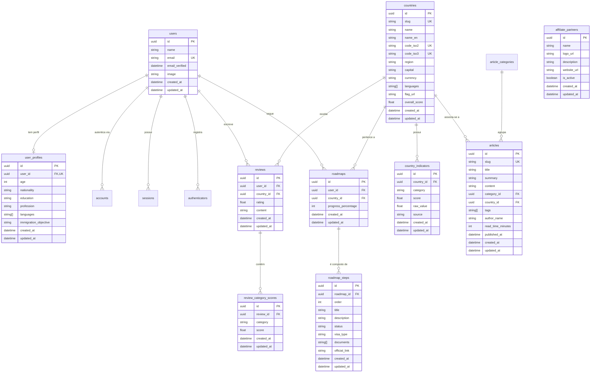
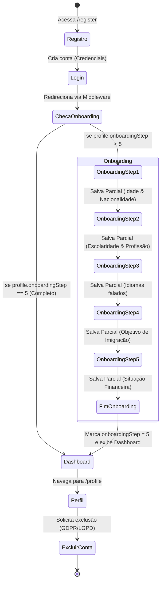

# Relatório Técnico de Engenharia — How To Immigrate

Este documento formaliza as decisões arquiteturais da infraestrutura técnica, de banco de dados e segurança do projeto **How To Immigrate**.

---

## 1. Convenções de Banco de Dados (Supabase & Prisma)

O banco de dados do projeto será estruturado em PostgreSQL hospedado no Supabase, gerenciado através do Prisma ORM (versão 7.x). Todas as tabelas e relacionamentos a serem criados na **Etapa 02 (Modelagem de Dados)** deverão seguir as seguintes regras:

### 1.1 Convenção de Nomenclatura
- **Tabelas no Banco (PostgreSQL):** Sempre em minúsculo e utilizando snake_case (ex: `user_profiles`, `immigration_steps`, `community_reviews`).
- **Modelos no Prisma:** Sempre em PascalCase (ex: `UserProfile`, `ImmigrationStep`, `CommunityReview`) com mapeamento explícito para o banco usando a diretiva `@@map`.
- **Campos/Colunas:** camelCase nos modelos Prisma (ex: `userId`, `createdAt`) mapeados para snake_case no banco usando `@map`.

### 1.2 Padrão de Chaves Primárias
- Todas as tabelas principais devem usar identificadores únicos globais baseados em **UUID v4**.
- Sintaxe no Prisma: `id String @id @default(uuid()) @db.Uuid`.

### 1.3 Timestamps e Auditoria
- Toda tabela/entidade deve conter os campos de auditoria temporal:
  - `createdAt` (`DateTime @default(now()) @map("created_at")`)
  - `updatedAt` (`DateTime @updatedAt @map("updated_at")`)

### 1.4 Soft Delete
- Para tabelas críticas (como `users`, `reviews` ou `comments`), o histórico não deve ser apagado fisicamente.
- Utilizar o campo opcional `deletedAt` (`DateTime? @map("deleted_at")`). As queries da aplicação devem filtrar entidades onde `deletedAt` seja nulo.

### 1.5 Convenção de Migrations
- As migrations do Prisma devem receber nomes em inglês descritivos e em minúsculo separados por hífen (ex: `20260625000000_create_users_table`).
- Nunca aplicar alterações manuais (via SQL Console do Supabase) que desviem da linha de migrations do Prisma.

---

## 2. Estrutura de Pastas do Projeto

A organização de diretórios do Next.js 15 segue a estrutura definitiva abaixo:

```
app/
  [locale]/                # Rotas internacionalizadas
    layout.tsx             # Layout raiz dinâmico com NextIntlClientProvider
    page.tsx               # Página inicial traduzida (Landing Page)
    globals.css            # Estilos globais e tokens Tailwind CSS v4
components/
  ui/                      # Componentes primitivos atômicos (Button, Input via shadcn)
  layout/                  # Componentes estruturais (Navbar, Footer, Sidebar)
  map/                     # Componentes específicos do Mapa Interativo
  country/                 # Componentes específicos das Páginas de País
  dashboard/               # Componentes de Painel e Estatísticas
lib/
  data/                    # Funções de busca e queries de dados (Server Actions/APIs)
  hooks/                   # Custom React Hooks reutilizáveis
  repositories/            # Abstrações de acesso a dados/banco (Padrão Repository)
  auth/                    # Configurações de autenticação (Auth.js v5 / NextAuth)
  store/                   # Gerenciamento de estado global com Zustand
  utils/                   # Funções auxiliares gerais (ex: cn helper)
prisma/
  schema.prisma            # Schema do banco de dados (Prisma 7.x)
i18n/
  routing.ts               # Definições de caminhos e locales do next-intl
  request.ts               # Carregador de traduções por requisição
messages/
  pt-BR.json               # Dicionário de português brasileiro
  en.json                  # Dicionário de inglês
public/                    # Assets estáticos públicos (svg, png, fonts)
scripts/                   # Scripts auxiliares de automação ou seed
middleware.ts              # Interceptador para segurança e i18n
```

### 2.1 Justificativa da Estrutura
- **i18n na raiz:** Facilita o mapeamento do plugin do `next-intl` no compilador do Next.js 15, garantindo suporte nativo a Server Components.
- **Divisão do components/:** Evita acúmulo de arquivos soltos. Separa componentes visuais simples (primitivos) de componentes altamente acoplados ao domínio do produto (como mapa ou dashboard).
- **lib/repositories/**: Permite isolar o Prisma Client das páginas do Next.js, facilitando a testabilidade e isolamento da camada de dados.

---

## 3. Contratos de Tipos e Evolução (Etapa 02)

Para o desenvolvimento em paralelo, criamos em `lib/data/types.ts` a modelagem preliminar das entidades de domínio. Na **Etapa 02**, esse arquivo foi complementado pelo arquivo de tipos tipados e derivados do Prisma em [generated-types.ts](file:///c:/Users/joaop/antigravity%20web%20projects/HowToImmigrate/lib/data/generated-types.ts). Todos os componentes de interface agora consomem os tipos derivados diretamente do banco de dados, garantindo consistência estrita de tipos em toda a aplicação.

---

## 4. Modelagem de Dados — Diagrama de Entidades (ERD)

Abaixo está a representação visual do banco de dados PostgreSQL estruturado por meio do Prisma ORM para suportar todas as funcionalidades do sistema:



---

## 5. Algoritmo de Scoring Transparente

O cálculo da nota geral de imigração de cada país (`overallScore`) é realizado através de uma média ponderada com os seguintes pesos definidos em [scoring.ts](file:///c:/Users/joaop/antigravity%20web%20projects/HowToImmigrate/lib/data/scoring.ts):

| Categoria do Indicador | Peso Ponderado | Justificativa |
| :--- | :--- | :--- |
| **Segurança (`safety`)** | `25%` (0.25) | Critério primordial de integridade física e estabilidade social. |
| **Custo de Vida (`costOfLiving`)** | `20%` (0.20) | Viabilidade financeira imediata para o sustento próprio. |
| **Mercado de Trabalho (`jobMarket`)** | `20%` (0.20) | Oportunidade de obtenção de renda e recolocação profissional. |
| **Facilidade de Visto (`visaEase`)** | `15%` (0.15) | Barreiras burocráticas de entrada e legalização. |
| **Saúde (`healthcare`)** | `10%` (0.10) | Qualidade de vida associada a infraestrutura e acesso médico. |
| **Adaptação Cultural (`culturalIntegration`)** | `10%` (0.10) | Facilidade de idioma e aceitação/receptividade da comunidade local. |

### 5.1 Fórmula Matemática

$$Score_{Geral} = \frac{\sum_{i=1}^{n} (Score_{i} \times Peso_{i})}{\sum_{i=1}^{n} Peso_{i}}$$

*Se algum indicador estiver ausente, a fórmula redistribui os pesos proporcionalmente entre os indicadores que estão presentes, dividindo a soma ponderada pela soma dos pesos presentes. Isso evita penalizações injustas a países com dados incompletos.*

### 5.2 Exemplo Numérico (Canadá)

Indicadores reais aproximados utilizados no Seed para o Canadá:
*   **Safety (25%):** 85.0
*   **Cost of Living (20%):** 45.0
*   **Job Market (20%):** 80.0
*   **Visa Ease (15%):** 65.0
*   **Healthcare (10%):** 88.0
*   **Cultural Integration (10%):** 90.0

Cálculo detalhado:
\[WeightedSum = (85 \times 0.25) + (45 \times 0.20) + (80 \times 0.20) + (65 \times 0.15) + (88 \times 0.10) + (90 \times 0.10)\]
\[WeightedSum = 21.25 + 9.00 + 16.00 + 9.75 + 8.80 + 9.00 = 73.80\]
\[Soma\ dos\ Pesos = 0.25 + 0.20 + 0.20 + 0.15 + 0.10 + 0.10 = 1.00\]
\[Score_{Geral} = \frac{73.80}{1.00} = 73.80\]

O `overallScore` final arredondado do Canadá será **73.80**.

---

## 6. Segurança de Dados — Políticas de RLS (Row-Level Security)

Para proteger dados de usuários e avaliações no Supabase, as seguintes políticas de Row-Level Security foram definidas para implantação na Etapa 04 (Autenticação):

### 6.1 Tabela `user_profiles`
*   **SELECT:** Permitido a qualquer usuário autenticado cujo `user_id` coincida com seu UUID (`auth.uid() = user_id`).
*   **INSERT / UPDATE:** Permitido apenas se `auth.uid() = user_id`.
*   **DELETE:** Bloqueado (usuários apenas desativam perfis ou usam Soft Delete).

### 6.2 Tabela `reviews`
*   **SELECT:** Acesso público irrestrito para avaliações que tenham sido moderadas e aprovadas pelo sistema.
*   **INSERT:** Permitido a qualquer usuário autenticado.
*   **UPDATE / DELETE:** Permitido somente se `auth.uid() = user_id` (o autor original da review) ou se o usuário autenticado possuir privilégios de administrador.

### 6.3 Tabela `roadmaps`
*   **SELECT / INSERT / UPDATE:** Acesso estrito e exclusivo ao dono da trilha (`auth.uid() = user_id`).

---

## 7. Sistema de Autenticação, Onboarding & Perfil (Etapa 04)

Na **Etapa 04**, a camada de autenticação segura e o questionário de onboarding multi-step responsivo foram totalmente consolidados.

### 7.1 Diagrama de Estados do Fluxo de Onboarding

O fluxo de dados de onboarding garante que novos usuários de credenciais ou OAuth Google tenham seu progresso armazenado de forma persistente a cada passo concluído (Resiliência contra Abandono):



Se o usuário fechar o browser no Passo 3, ao efetuar novo login, a página `/dashboard` identifica que `onboardingStep` é 2 e redireciona instantaneamente o usuário para o Passo 3 (`onboardingStep + 1`), restaurando o estado local das etapas salvas anteriormente.

### 7.2 Medidas de Segurança de Autenticação

1.  **Criptografia de Senha (bcrypt):** Senhas locais são hasheadas via `bcryptjs` utilizando fator de custo **12** (work factor balanceado entre forte segurança contra brute force offline e desempenho aceitável do servidor).
2.  **Rate Limiting no Login (Anti-Brute Force):** Implementado no CredentialsProvider do NextAuth v5 um contador de tentativas por IP. Máximo de **10 tentativas por IP por hora**, retornando bloqueio do IP caso excedido.
3.  **Cookies e Sessões Seguras:** Cookies de sessão JWT do Auth.js possuem `HttpOnly` ativo (prevenção contra ataques XSS), `Secure` em produção (transmissão restrita a conexões HTTPS) e `SameSite=Lax` (proteção contra CSRF).
4.  **Integração de Roteamento Síncrono:** Uso do comportamento de redirecionamento nativo do NextAuth v5 no formulário de login para garantir que os cookies de sessão sejam gerados no cabeçalho HTTP da resposta do servidor antes da renderização das rotas protegidas no browser, eliminando race conditions comuns.

### 7.3 Conformidade com Privacidade (GDPR/LGPD)

1.  **Exportação de Dados:** Na tela `/profile`, o usuário pode acionar a exportação e baixar um arquivo JSON estruturado contendo todos os dados do seu cadastro, perfil de onboarding e lista de favoritos.
2.  **Exclusão Permanente (Esquecimento):** Disponibilizada a exclusão física e definitiva do registro de usuário. A exclusão dispara a diretiva `onDelete: Cascade` no banco de dados, apagando imediatamente todas as entidades dependentes (`UserProfile`, `Account`, `Session`, `UserFavoriteCountry`, `UserRoadmapProgress`, `UserSearchHistory`).

### 7.4 Políticas de RLS Adicionais (Supabase)

Para garantir segurança na persistência de dados das novas tabelas:
*   `user_favorite_countries`: Leitura e escrita permitidas apenas se `auth.uid() = user_id`.
*   `user_roadmap_progress`: Leitura e modificação restritas ao proprietário da conta.
*   `user_search_history`: Histórico de busca protegido para acesso exclusivo do respectivo usuário.

